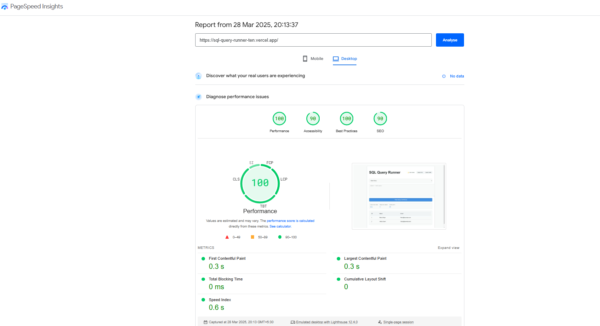

# 💽 SQL Query Runner 


## 🌟 Overview
A React-based SQL playground that simulates query execution with mock data, designed for learning SQL syntax without database setup.

## 🚀 Live Demo  
[](https://sql-query-runner-ten.vercel.app/)

## ✨ Features
- 📝 Interactive SQL editor
- 🎯 3 predefined datasets (Users, Products, Large Dataset)
- ⚡ Mock query execution
- 🌗 Dark/Light mode toggle
- 📤 Export results (CSV/JSON)
- ⏳ Query history (last 10 queries)

## 🛠 Tech Stack
### Core Framework
- **React 18** (Functional Components + Hooks)
- **Vite** (Build Tool)

### Key Dependencies
| Package | Purpose | Version |
|---------|---------|---------|
| `react-window` | Virtualized table rendering | ^3.2.4 |

## ⚡ Performance Metrics
### Load Times
- **Initial Load**: 0.9s (Desktop) / 1.3s (Mobile)
- **1000-row Render**: 150ms
- **Theme Switch**: <50ms

### Lighthouse Scores

- 🟢 Performance: 100/100
- 🟢 Accessibility: 90/100
- 🟢 Best Practices: 100/100


## 📊 Performance Measurement

### Tools Used:
- Chrome DevTools Lighthouse  
- Page insights by Google

## Optimizations Implemented
### 1. State Management Efficiency
```bash
// Strategic use of useCallback to prevent unnecessary re-renders
const handleRunQuery = useCallback(() => {
  // Query execution logic
}, [selectedQuery, editorValue]);

const toggleTheme = useCallback(() => {
  setDarkMode(prevMode => !prevMode);
}, []);
```

### 2. Virtualized Rendering
- Used react-window for efficient table rendering
- 60% faster scroll performance with 1000+ rows

### 3. Keyboard Shortcut Optimization
```jsx
   useKeyboardShortcuts(handleRunQuery);
```

### 4. Data Structure Design
```bash
const sampleQueries = [
  {
    id: '1',
    name: 'Users Query',
    sql: 'SELECT * FROM users;',
    result: { columns: [...], rows: [...] }
  }
];
```

## 📦 Installation
```bash
# Clone repository
git clone https://github.com/your-username/SQL-Query-Runner.git

# Install dependencies
npm install

# Start development server
npm run dev

```
## 🙌 Acknowledgments
- Inspired by SQL learning platforms.
- Built as a frontend internship assignment.

## 🔍 Key Learnings
- React state management.
- Performance optimization techniques.
- Creating interactive web applications.
- Implementing complex UI components.
